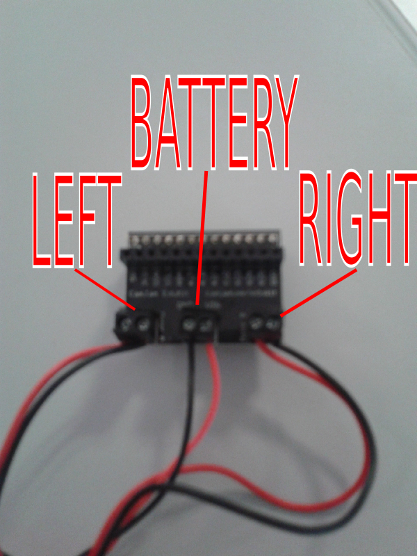
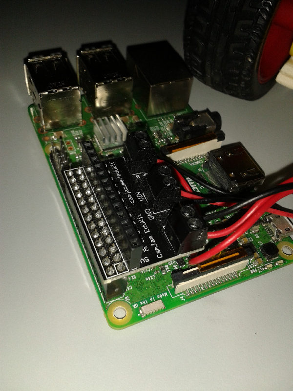

## Build the Kart

### Components

- [Motors and wheels](https://thepihut.com/products/camjam-edukit-3-robotics)
- [Raspberry Pi 3 B](https://www.raspberrypi.org/products/raspberry-pi-3-model-b/)
- MicroSD card, minimum 8 GB
- PowerBank: [this](https://www.amazon.it/gp/product/B01AUNIBJI) or similar
- 4 battery model AA
- other stuff like wood board, screws, scotch tape, rubber bands

### Build

#### Base
You can build the kart following the instructions from [CamJam Edukit](https://thepihut.com/products/camjam-edukit-3-robotics).
It's a good solution, but I suggest to use a small wood board with and a wheel like [this](http://i.ebayimg.com/thumbs/images/g/eMcAAOSwmfhX4-7-/s-l225.jpg) instead of the box and wheel from the kit, because they are very unstable. Anyway, remember the kit come for educational scope.

#### Raspberry and Motors

Put the wheels at the edge of the container, pay attention to have connection **inside**.

Then, connect to board module in this way.

It's not the only way to do, but it's the way that match with current software GPIO configuration. Pay attention to wires order. 

Finally, connect the module to Raspberry.

#### Powerbank and batteries

Connect the Raspberry to Powerbank by power cable. 
Put batteries into motors battery box and turn it on.
Pack everything, with rubber bands or other stuff, as you like.

---

Next step is [Setup software](./Setup.md)